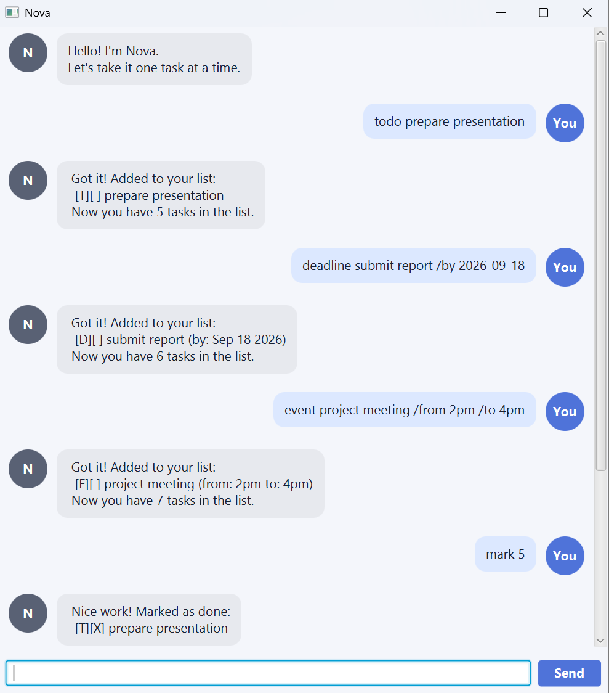

# Nova User Guide

Nova is a friendly task-tracking chatbot that helps you manage todos, deadlines, and events,
one task at a time.



## Getting started

Open Nova, type a command in the box at the bottom, and press **Enter** or click **Send**.
Scroll up to revisit earlier replies.

Try `todo borrow book`, then `list` to see your first task. Enter `help` whenever you need
a reminder of the commands.

Commands are **case-sensitive**: use lowercase command words and the spaces shown below.
Replace uppercase placeholders such as `DESCRIPTION` with your own text; do not type the
placeholder itself. Descriptions may contain spaces and must not be empty.

## Adding tasks

### Todo: `todo DESCRIPTION`

Adds a task without a date or time.

```text
todo borrow book
```

### Deadline: `deadline DESCRIPTION /by yyyy-MM-dd`

Adds a task due on a specific date. Use a valid date in **year-month-day** format, with a
four-digit year and two-digit month and day. For example, `2026-09-30` is displayed as
`Sep 30 2026`. Times and phrases such as `tomorrow` are not accepted here.

```text
deadline submit report /by 2026-09-30
```

### Event: `event DESCRIPTION /from START /to END`

Adds an event with a start and end. Both are required, but there is no fixed date or time
format: Nova displays them as you enter them. Check the dates and times yourself.

```text
event project meeting /from Monday 2pm /to Monday 4pm
```

## Viewing and updating tasks

Enter `list` to display all tasks and their numbers. `[T]`, `[D]`, and `[E]` mean todo,
deadline, and event. `[ ]` means incomplete; `[X]` means done.

For example, `1.[T][ ] borrow book` is incomplete todo number 1.

| Action | Format | Example |
| --- | --- | --- |
| View all tasks | `list` | `list` |
| Mark a task as done | `mark TASK_NUMBER` | `mark 1` |
| Mark a task as incomplete again | `unmark TASK_NUMBER` | `unmark 1` |
| Remove a task | `delete TASK_NUMBER` | `delete 1` |

Use an existing task number from `list`, starting at **1**. Deleting a task changes the
numbers of later tasks, so check `list` again before updating another task.

## Finding tasks

### By description: `find KEYWORD`

Shows tasks whose descriptions contain your search text. Matching is **case-sensitive**:
`book` matches `borrow book` and `bookshop`, but not `Book`. Dates and event times are not
searched. The search text must not be empty.

```text
find book
```

### By deadline date: `on yyyy-MM-dd`

Shows deadlines due on the given valid date, using the same date format as `/by`.
This search does not include todos or events.

```text
on 2026-09-30
```

Both searches keep the task numbers from the full list. If nothing matches, Nova shows
a heading with no tasks underneath.

## Getting help and ending a session

- **`help`** lists all supported commands and their syntax. Example: `help`.
- **`bye`** displays a farewell and ends the session. Example: `bye`.
  In the GUI, the input box and Send button become disabled; close the window when finished.
  Reopen Nova to start another session.

Enter `list`, `help`, and `bye` on their own, without extra arguments.

## Saving and handling errors

Nova saves successful task changes automatically and loads your tasks when you reopen it.
There is no save command. Keep launching Nova from the same folder so it finds the same
saved tasks. If no saved task file exists, Nova starts with an empty list.

If a command is incomplete, a date is invalid, or a task number does not exist, Nova explains
the problem. Correct the command and try again, or enter `help` for the syntax.
If saving fails, Nova reports the error and leaves the task list unchanged. It also reports
loading problems and warns when corrupted task records are skipped.
